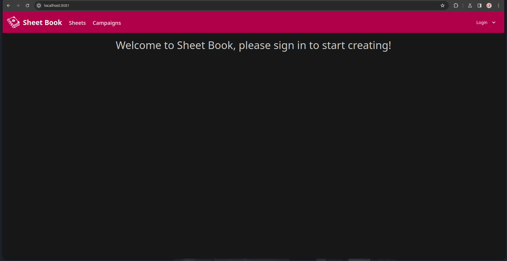
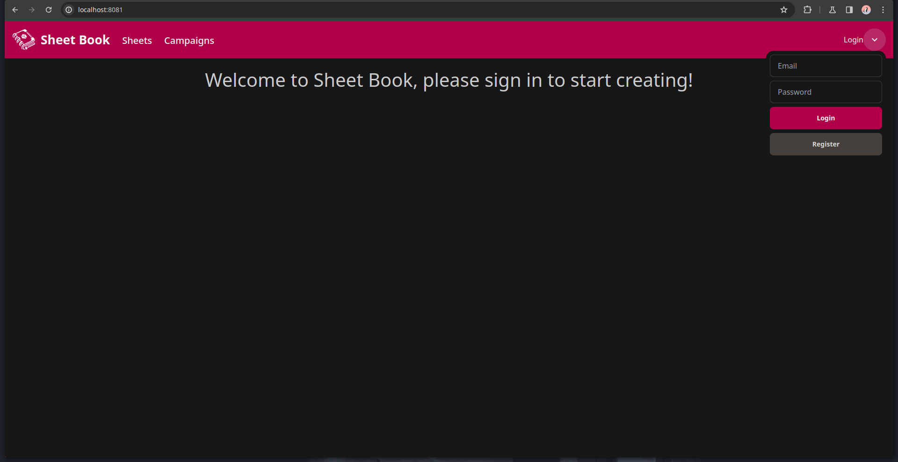
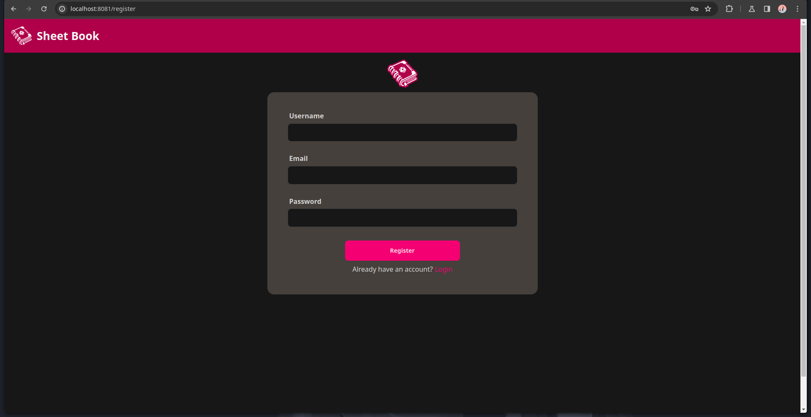
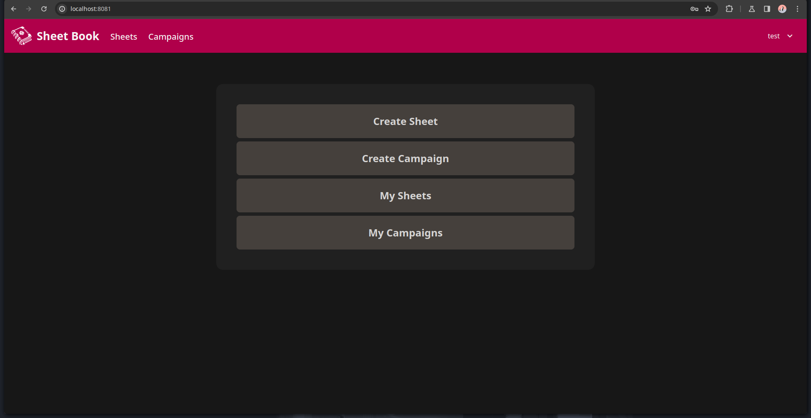
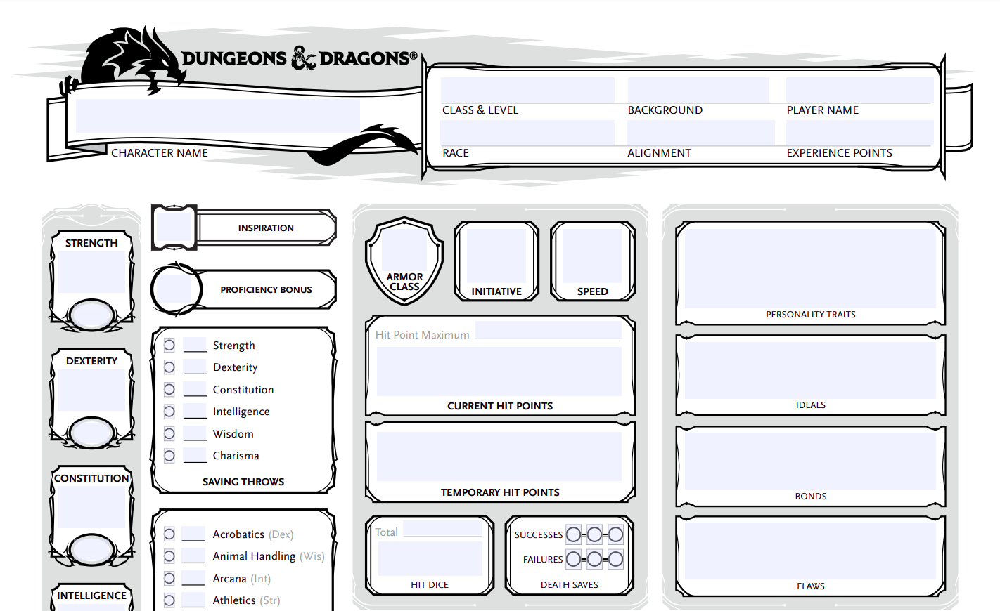
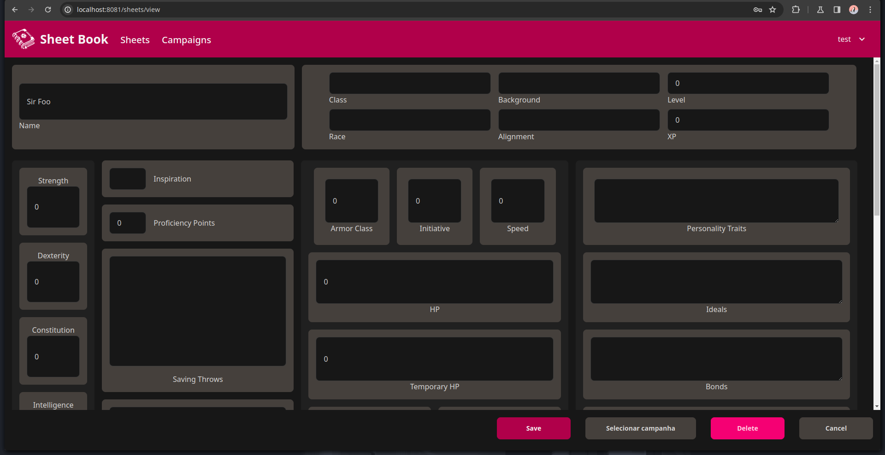
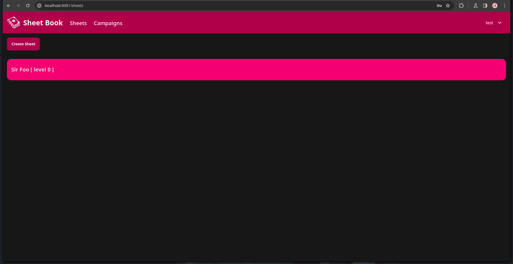
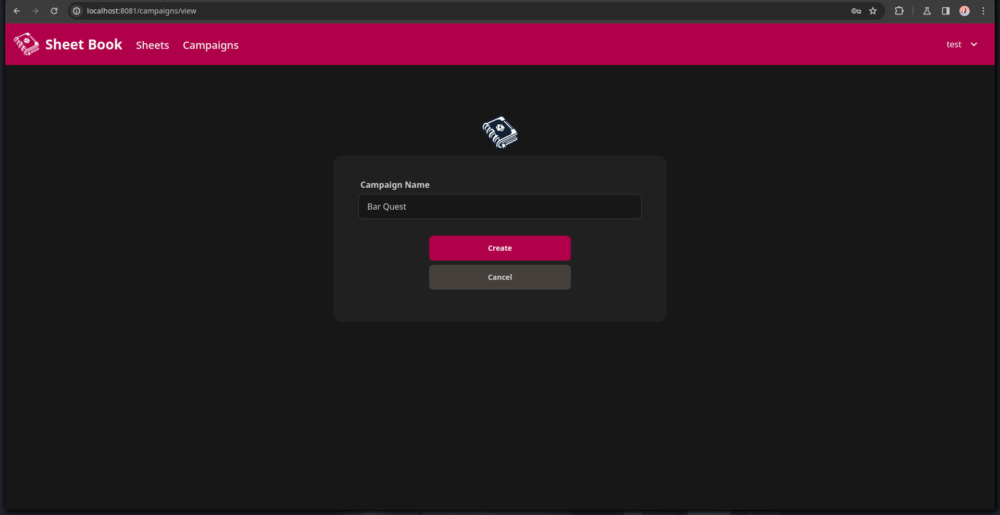
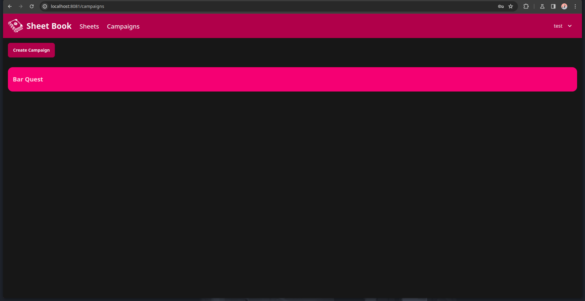
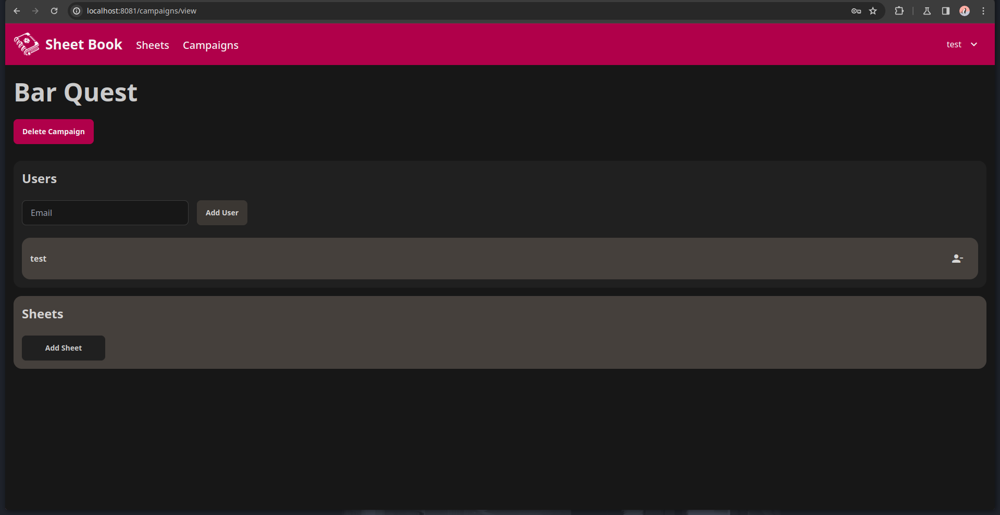

# <!---fit---> Sheet Book 
## Projeto de MAC0350
Diogo Ribeiro n° 12717033
Luiz Fernando n° 13671678

---
# Planejamento

    <section>
        <h2>Plano inicial</h2>
        <ul>
            <li>Criação e edição de fichas de personagens</li>
            <li>Gerenciamento de campanhas e seus participantes</li>
            <li>Interface de interação entre mestre e jogadores</li>
            <li>Simulação de dados do jogo</li>
        </ul>
    </section>
    <section>
        <h2>O que foi feito</h2>
        <ul>
            <li>Criação e edição de fichas de personagens</li>
            <li>Gerenciamento de campanhas e seus participantes</li>
        </ul>
    </section>

---

# Desenvolvimento (emoji aqui)
## Primeiros Ciclos 

Maior foco no back end, principalmente na implementação do banco de dados.
- Implementado usando Exposed e H2

---
## Ciclos Mais Recentes
Foco no front end, implementando mais funcionalidades e deixando o site mais bonito
- Implementado usando Vit e React (colocar imagem de vit e react)

---

# Página Inicial (não logado)

---

# Menu de Login

---

# Página de Cadastro

---

# Página Inicial (logado)

---

# Ficha de D&D 5

---

# Página de Criação de Ficha

---

# Página de Fichas

---

# Página de Criar Campanha

---

# Página de Campanhas

---

# Página de Gerenciar Campanha
