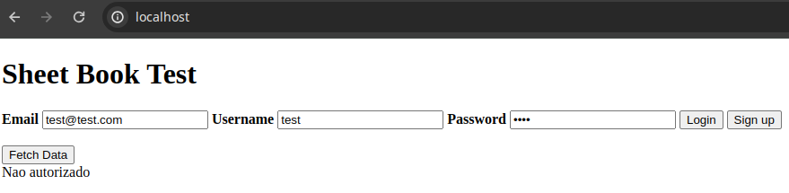
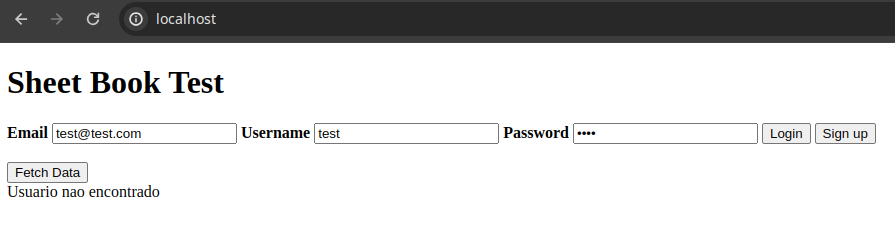
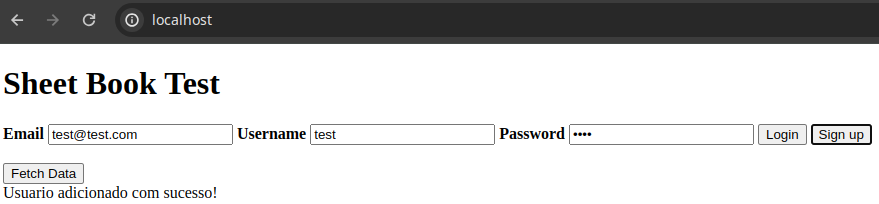
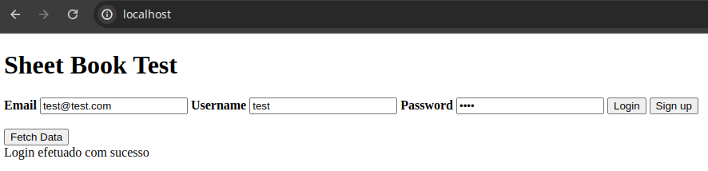
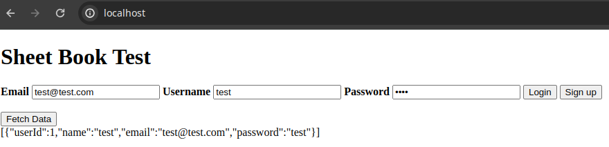

# <!---fit---> Sheet Book :books:
## Projeto de MAC0350
Diogo Ribeiro n° 12717033
Luiz Fernando n° 13671678

---

# Introdução :mag_right:

Com o objetivo de facilitar a organização e a criação de conteúdo para mestres e jogadores, **Sheet Book** oferece serviços de
- Criação e edição de fichas de personagens;
- Gerenciamento de campanhas e seus participantes;
- Interface para a interação entre jogadores e mestres;
- Simulação de dados de jogo;
- Compartilhamento de personagens.

A aplicação web conta com um sistema de autenticação, permitindo que os usuários criem e acessem suas fichas e campanhas de qualquer lugar.

---

# Progresso :chart_with_upwards_trend:

    <section>
        <h2>Implementado</h2>
        <ul>
            <li>Autenticação de usuários;</li>
            <li>Criação e listagem de contas;</li>
            <li>Criação e listagem de fichas de personagens;</li>
            <li>Criação e listagem de campanhas.</li>
        </ul>
    </section>
    <section>
        <h2>Em Desenvolvimento</h2>
        <ul>
            <li>Edição de fichas de personagens;</li>
            <li>Gerenciamento de campanhas e seus participantes;</li>
            <li>Simulação de dados de jogo;</li>
            <li>Compartilhamento de personagens.</li>
        </ul>
    </section>

---

# Teste da Autenticação :key:
Com o html de teste acessado através de um servidor http (*apache*).

Quando tentamos acessar a lista de usuários sem fazer login:

Quando tentamos fazer login sem um usuário cadastrado:

---

# Teste do Banco de Dados :floppy_disk:

Quando criamos um novo usuário:

Quando fazemos login com um usuário cadastrado:

---

# Teste do Banco de Dados :floppy_disk:

Quando acessamos a lista de usuários após fazer login:

