# <!---fit---> Sheet Book 
## Projeto de MAC0350
Diogo Ribeiro n° 12717033
Luiz Fernando n° 13671678

---

# Visão Inicial do Projeto :mag_right:
- Criação e edição de fichas de personagens;
- Gerenciamento de campanhas e seus participantes;
- Interface para a interação entre jogadores e mestres;
- Simulação de dados de jogo;
- Compartilhamento de fichas.

---

# Primeiros Ciclos 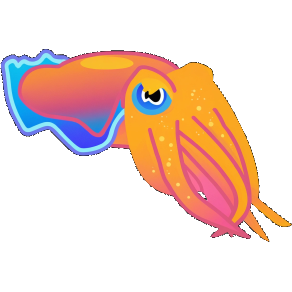  

Planejamento inicial das classes e funcionalidades do projeto.
Maior foco no back-end com **Ktor**, principalmente na implementação do banco de dados, utilizando **Exposed** e **H2**.
Desenvolvimento dos testes automatizados iniciais para o back-end.

## Dificuldades :warning:
- Aprendizado de **Kotlin**, do **Ktor** e **Exposed**;
- Documentação  escassa do **Exposed**;
- Falta de guias para o desenvolvimento de testes com banco de dados **H2**.

---
# Ciclos Mais Recentes  

Planejamento das páginas e funcionalidades do site.
Foco no front-end, implementando mais funcionalidades, trabalhando na integração e melhorando o visual do site (implementado usando **Vit** e **React**).
Desenvolvimento de mais testes automatizados para as novas funcionalidades.

## Dificuldades :warning:
- Aprendizado de tecnologias para o front-end;
- Integração entre **Ktor** e o **React**;
- Problemas com autenticação do CORS;
- Planejamento das rotas no servidor.

---

# Docker Conteiners 
Encapsulamento dos servidores do back e front-end em containers **Docker**.
Facilita a execução e distribuição do projeto.

## Dificuldades :warning:
- Configuração dos containers para a comunicação entre os servidores;
- Execução do **Gradle** no container do **Ktor**.

---

# Página Inicial (não logado)
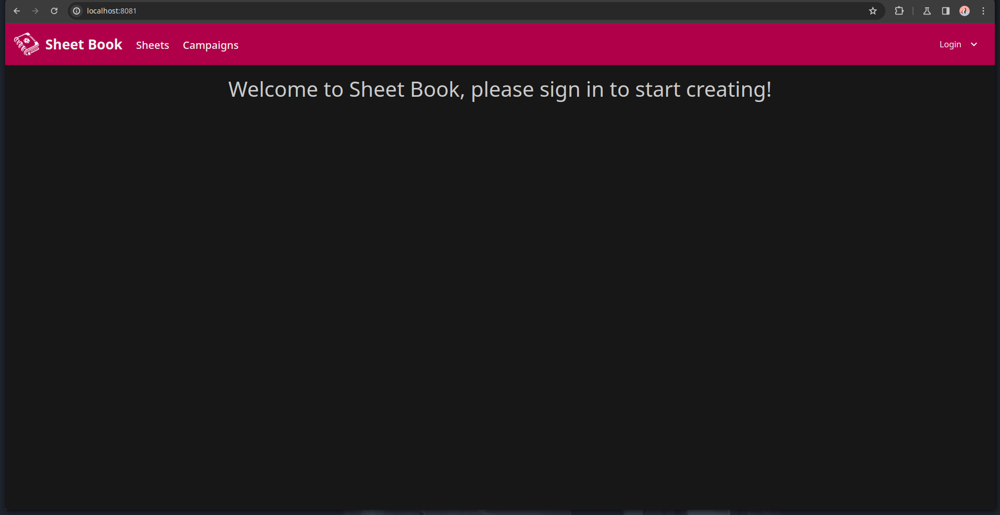

---

# Menu de Login
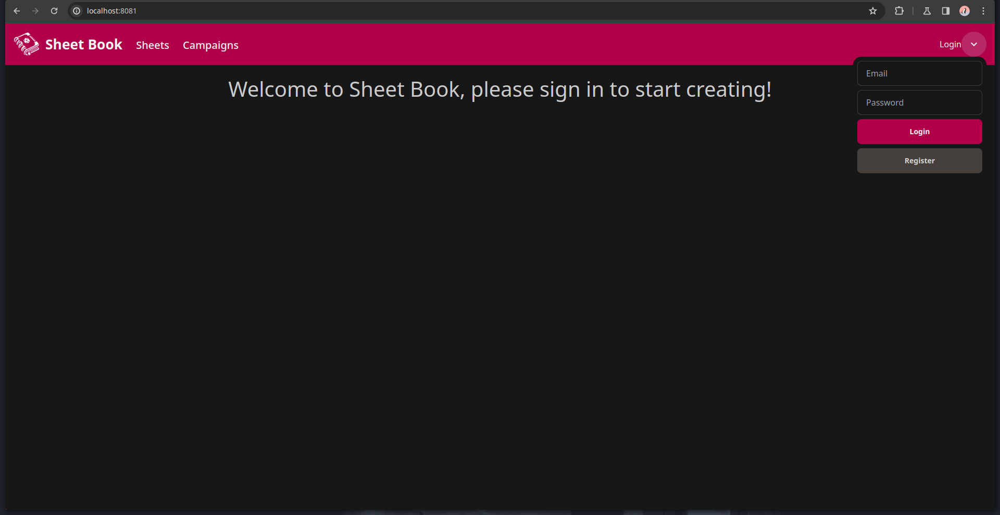

---

# Página de Cadastro
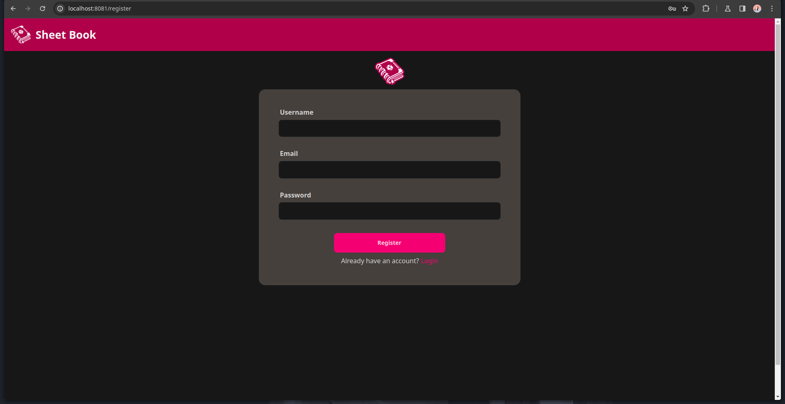

---

# Página Inicial (logado)

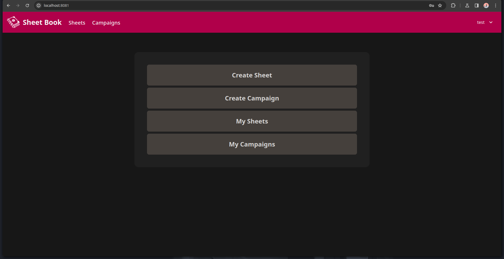

---

# Ficha de D&D 5
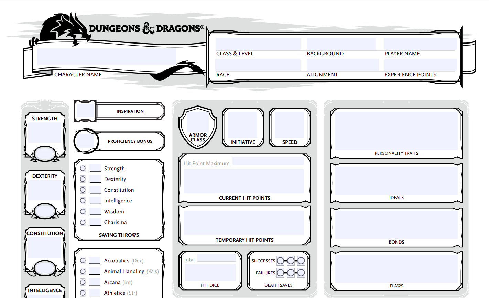

---

# Página de Criação de Ficha
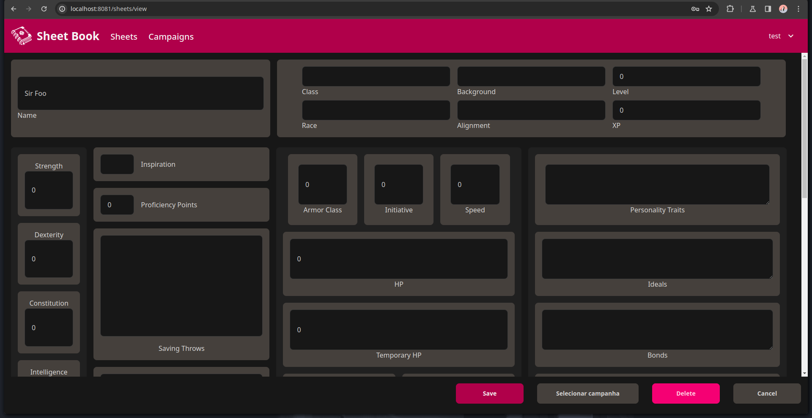

---

# Página de Fichas
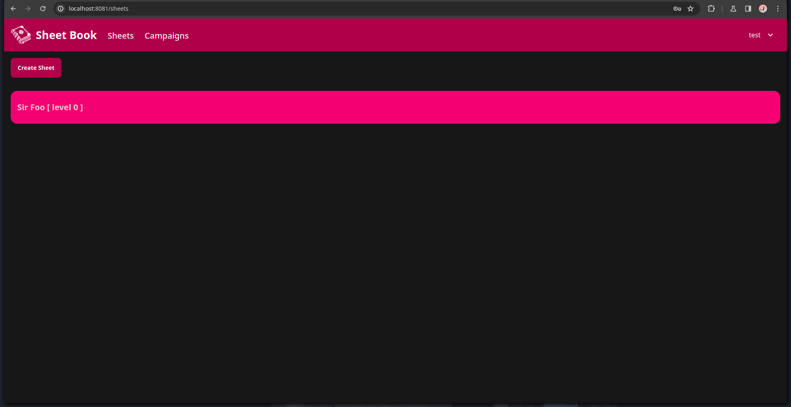

---

# Página de Criar Campanha
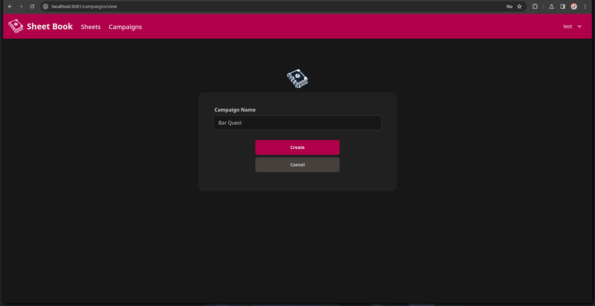

---

# Página de Campanhas
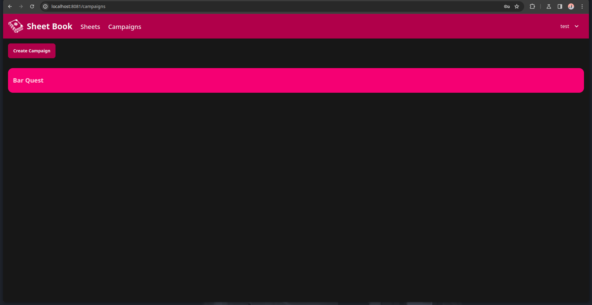

---

# Página de Gerenciar Campanha
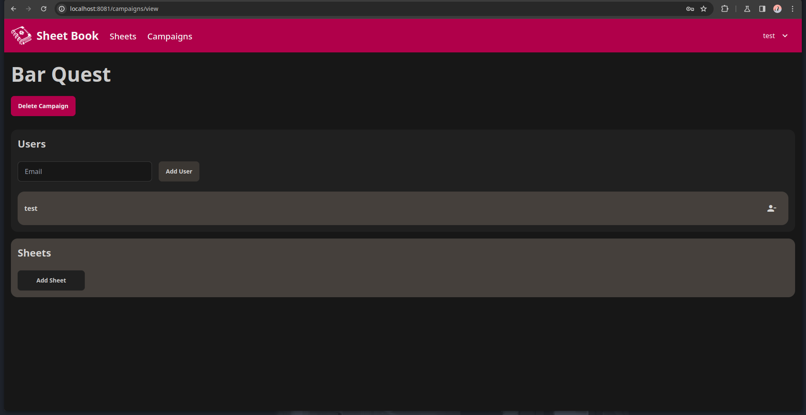

---

# Próximos Passos :rocket:

- Implementar a interface de interação entre mestre e jogadores;
- Implementar a simulação de dados do jogo;
- Implementar o compartilhamento de fichas;
- Melhorar o aspecto visual do site.